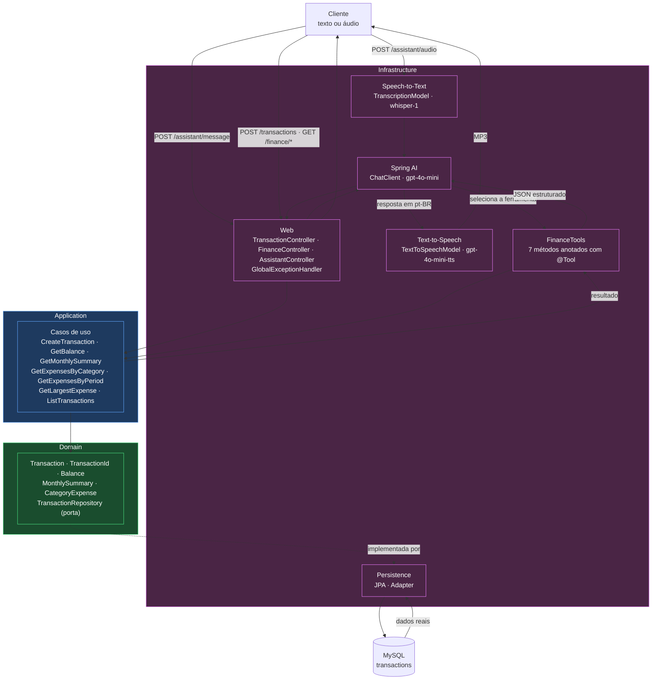

# SmartBudget AI

API de gestão financeira pessoal em que o usuário registra e consulta transações escrevendo ou falando em português. A interpretação da linguagem natural é feita com Spring AI, e a execução das operações acontece através de Tool Calling, que aciona casos de uso reais da aplicação e persiste os dados em MySQL.

O princípio que orienta o projeto é a separação entre linguagem e verdade:

> O banco de dados é a fonte da verdade. O modelo de linguagem é a interface.

O modelo não persiste nada por conta própria e não calcula valores. Ele escolhe a ferramenta adequada, passa os parâmetros e apresenta o resultado devolvido pela aplicação.

---

## Desafio DIO

Projeto final da trilha de Spring Boot da Digital Innovation One:

- Trilha completa: <https://github.com/digitalinnovationone/dio-spring-boot-learning-track>
- Módulo do projeto final: <https://github.com/digitalinnovationone/dio-spring-boot-learning-track/tree/main/05-spring-ai>

O projeto de referência foi usado como base de requisitos, stack e integração. A implementação aqui é própria, com arquitetura em camadas explícitas, API REST convencional completa, tratamento de erros padronizado, suíte de testes automatizados e a evolução descrita em [Financial Insights](#financial-insights).

---

## Arquitetura



### Regra de dependência

```
Infrastructure  ──depende de──▶  Application  ──depende de──▶  Domain
```

O domínio não conhece Spring, JPA, HTTP nem OpenAI. `Transaction` é uma classe Java validada por construção, testável sem contexto de aplicação. A persistência entra pela porta `TransactionRepository`, declarada no domínio e implementada na infraestrutura.

As tools são finas por decisão de projeto: convertem os argumentos textuais, chamam o caso de uso e devolvem o resultado estruturado. Nenhuma regra de negócio vive nelas, de modo que registrar uma despesa pelo REST ou pela IA passa exatamente pelas mesmas validações.

### Convenções da trilha

| Convenção | Implementação |
|---|---|
| Camadas DDD | `domain/` · `application/` · `infrastructure/` |
| Class vs record | `Transaction` é `class`; `Balance`, `MonthlySummary`, `CategoryExpense`, `DateRange` e DTOs são `record` |
| Strong typed identifiers | `TransactionId` encapsula o `UUID` |
| Repository pattern | Contrato no domínio, adapter JPA na infraestrutura |
| Use cases | Uma classe por capacidade de negócio, compartilhada entre REST e Tool Calling |
| Docker Compose | `compose.yml` com MySQL e volume persistente |

---

## Tecnologias

| Camada | Tecnologia |
|---|---|
| Linguagem | Java 25 |
| Framework | Spring Boot 4.0.5 |
| IA | Spring AI 2.0.0-M4 + OpenAI |
| Chat | `gpt-4o-mini` com Tool Calling |
| Speech-to-Text | `whisper-1` (pt-BR) |
| Text-to-Speech | `gpt-4o-mini-tts` (mp3) |
| Web | Spring Web + Bean Validation |
| Persistência | Spring Data JPA + Hibernate |
| Banco | MySQL 9.6 |
| Infra local | Docker Compose |
| Build | Gradle 9.7 (Wrapper incluído) |
| Testes | JUnit 5 + AssertJ + Mockito + H2 |

---

## Funcionalidades

### Assistente

| Comando | Ferramenta acionada |
|---|---|
| "Registre uma despesa de 85 reais com Uber" | `createTransaction` |
| "Gastei 45 reais no McDonalds" | `createTransaction` (deduz `EXPENSE` + `FOOD`) |
| "Recebi meu salário de 5000 reais" | `createTransaction` (deduz `INCOME` + `SALARY`) |
| "Qual é o meu saldo?" | `getBalance` |
| "Quanto eu gastei hoje?" | `getExpensesByPeriod` |
| "Quanto gastei com transporte?" | `getExpensesByCategory` |
| "Onde eu mais gastei neste mês?" | `getExpensesByCategory` |
| "Mostre minhas últimas transações" | `listTransactions` |
| "Qual foi minha maior despesa?" | `getLargestExpense` |
| "Faça um resumo financeiro deste mês" | `getMonthlySummary` |

Quando falta informação obrigatória, o assistente pergunta em vez de assumir um valor. O comando "Registre uma despesa de Uber" não dispara nenhuma ferramenta: a resposta é uma pergunta pelo valor.

### API REST

| Método | Rota | Descrição |
|---|---|---|
| `POST` | `/api/v1/transactions` | Cria transação |
| `GET` | `/api/v1/transactions` | Lista com filtros `from`, `to`, `type`, `category`, `limit` |
| `GET` | `/api/v1/transactions/{id}` | Busca por id |
| `DELETE` | `/api/v1/transactions/{id}` | Remove |
| `GET` | `/api/v1/finance/balance` | Saldo do período |
| `GET` | `/api/v1/finance/summary` | Resumo mensal |
| `GET` | `/api/v1/finance/expenses-by-category` | Distribuição por categoria |
| `POST` | `/api/v1/assistant/message` | Assistente por texto |
| `POST` | `/api/v1/assistant/audio` | Assistente por voz (JSON, ou MP3 com `Accept: audio/mpeg`) |

### Regras do domínio

- Valores monetários em `BigDecimal`, maiores que zero, normalizados para duas casas com `HALF_UP`
- Descrição obrigatória, sem espaços nas pontas, máximo 255 caracteres
- Tipo e categoria obrigatórios
- Data não pode estar no futuro; quando omitida, assume a data corrente
- Identificador tipado `TransactionId`, gravado como `CHAR(36)`

### Categorias

`FOOD` · `TRANSPORT` · `HOUSING` · `HEALTH` · `EDUCATION` · `ENTERTAINMENT` · `SHOPPING` · `SALARY` · `INVESTMENT` · `OTHER`

---

## Financial Insights

Evolução implementada sobre o desafio original: o assistente consulta dados reais persistidos e gera resumos mensais com receitas, despesas, saldo, quantidade de transações, maior gasto e distribuição percentual por categoria.

A motivação é direta. Um assistente que apenas registra gastos é um formulário com voz; o valor aparece quando ele responde "como estão meus gastos este mês?". Esse é justamente o ponto em que um modelo de linguagem tende a falhar, porque somas e percentuais pedidos em texto livre costumam ser inventados com aparência de correção.

A solução inverte a responsabilidade. A pergunta dispara `getMonthlySummary`, que executa cinco agregações no banco:

```sql
SUM(amount) WHERE type = 'INCOME'
SUM(amount) WHERE type = 'EXPENSE'
COUNT(*)
ORDER BY amount DESC LIMIT 1
GROUP BY category ORDER BY SUM DESC
```

O saldo é derivado no domínio e os percentuais calculados em `BigDecimal` com escala controlada. O modelo recebe o resultado pronto e formatado:

```json
{
  "month": "2026-08",
  "totalIncome": "R$ 5.000,00",
  "totalExpense": "R$ 1.040,00",
  "netBalance": "R$ 3.960,00",
  "transactionCount": 5,
  "largestExpense": { "description": "Supermercado", "amount": "R$ 500,00" },
  "expensesByCategory": [
    { "category": "Alimentação", "total": "R$ 545,00", "shareOfExpenses": "52,40%" },
    { "category": "Transporte",  "total": "R$ 495,00", "shareOfExpenses": "47,60%" }
  ]
}
```

Resta ao modelo transformar isso em texto. Ele não soma, não divide e não arredonda. Enviar os valores já formatados também elimina erros de separador decimal em português.

---

## Estrutura do projeto

```
src/main/java/com/smartbudget/
│
├── SmartBudgetApplication.java
│
├── domain/
│   ├── model/                       Transaction, TransactionId, Balance,
│   │                                MonthlySummary, CategoryExpense, DateRange
│   ├── repository/                  TransactionRepository (porta)
│   └── exception/                   DomainException e subtipos
│
├── application/
│   ├── dto/                         Command e Views
│   └── usecase/                     9 casos de uso
│
└── infrastructure/
    ├── web/                         controllers, requests, responses,
    │                                GlobalExceptionHandler
    ├── persistence/                 entity, mapper, JPA, adapter da porta
    └── ai/
        ├── config/                  ChatClientConfig, AssistantProperties
        ├── service/                 AssistantService, TranscriptionService,
        │                            SpeechService, VoiceAssistantService
        ├── tools/                   FinanceTools, ToolResults
        ├── support/                 BrazilianFormat, ToolArguments
        └── exception/               erros de IA, áudio e transcrição

src/main/resources/
├── application.properties
├── prompts/assistant-system.txt
└── static/index.html                console de demonstração com microfone

src/test/java/com/smartbudget/
├── domain · application · infrastructure    testes automatizados
└── integration/                             testes reais, pulados sem a chave

src/test/resources/audio/            áudios em pt-BR para os testes de integração
```

---

## Como executar

### Requisitos

| Item | Versão | Observação |
|---|---|---|
| JDK | 25 | `JAVA_HOME` apontando para ele |
| Docker Desktop | qualquer | precisa estar em execução |
| Chave OpenAI | — | obrigatória para iniciar a aplicação |

Gradle não precisa estar instalado: o Wrapper está versionado.

### 1. Configurar a chave da OpenAI

Windows PowerShell:

```powershell
$env:OPENAI_API_KEY="your_api_key_here"
```

Linux / macOS:

```bash
export OPENAI_API_KEY="your_api_key_here"
```

A variável vale apenas para a sessão atual do terminal. A aplicação não inicia sem ela.

### 2. Subir o banco

```powershell
docker compose up -d
docker compose ps
```

O MySQL usa o volume `smart_budget_data`, então os dados sobrevivem a `docker compose down` e a reinicializações.

### 3. Executar a aplicação

Windows PowerShell:

```powershell
.\gradlew.bat bootRun
```

Linux / macOS:

```bash
./gradlew bootRun
```

A API sobe em <http://localhost:8081>. Abrir esse endereço no navegador mostra um console de demonstração com microfone.

### 4. Rodar os testes

Windows PowerShell:

```powershell
.\gradlew.bat clean test
```

Linux / macOS:

```bash
./gradlew clean test
```

Os testes não exigem Docker nem chave da OpenAI.

### Portas

Os padrões evitam conflito com serviços comuns em máquinas de desenvolvimento:

| Serviço | Padrão | Variável |
|---|---|---|
| API HTTP | `8081` | `SMARTBUDGET_PORT` |
| MySQL (host) | `3308` | `SMARTBUDGET_DB_PORT` |

```powershell
$env:SMARTBUDGET_PORT="9090"
$env:SMARTBUDGET_DB_PORT="3307"
```

`SMARTBUDGET_DB_PORT` é lida tanto pelo `compose.yml` quanto pelo `application.properties`.

---

## Exemplos de requisições

A coleção completa está em [`requests.http`](requests.http), pronta para a extensão REST Client do VS Code.

### Registrar uma despesa

```http
POST http://localhost:8081/api/v1/assistant/message
Content-Type: application/json

{
  "message": "Registre uma despesa de 89 reais com Uber"
}
```

```json
{ "message": "A despesa de R$ 89,00 com Uber foi registrada com sucesso." }
```

### Consultar o saldo

```http
POST /api/v1/assistant/message
{ "message": "Qual é o meu saldo?" }
```
```json
{ "message": "Seu saldo atual é de R$ 4.005,00." }
```

### Consultar uma categoria

```http
POST /api/v1/assistant/message
{ "message": "Quanto eu gastei com transporte?" }
```
```json
{ "message": "Você gastou um total de R$ 495,00 com transporte, o que representa 49,75% das suas despesas. Foram registradas 2 transações nessa categoria." }
```

### Resumo mensal

```http
POST /api/v1/assistant/message
{ "message": "Faça um resumo financeiro deste mês" }
```
```
Aqui está o resumo financeiro do mês de agosto de 2026:

- Total de Receitas: R$ 5.000,00
- Total de Despesas: R$ 1.040,00
- Saldo Líquido: R$ 3.960,00
- Quantidade de Transações: 5

Maior Despesa: Supermercado — R$ 500,00 (Alimentação, 14/08/2026)

Despesas por Categoria
1. Alimentação: R$ 545,00 (52,40% do total)
2. Transporte:  R$ 495,00 (47,60% do total)
```

### Informação incompleta

```http
POST /api/v1/assistant/message
{ "message": "Registre uma despesa de Uber" }
```
```json
{ "message": "Qual é o valor da despesa com o Uber que você gostaria de registrar?" }
```

### REST convencional

```bash
curl -X POST http://localhost:8081/api/v1/transactions \
  -H "Content-Type: application/json" \
  -d '{"description":"Supermercado","amount":500.00,"type":"EXPENSE","category":"FOOD"}'

curl http://localhost:8081/api/v1/finance/balance
curl "http://localhost:8081/api/v1/finance/summary?month=2026-08"
```

---

## Testando por voz

### Console web

Com a aplicação rodando, abra <http://localhost:8081>. A página grava pelo microfone com a API `MediaRecorder`, envia para `POST /assistant/audio`, mostra a transcrição e toca a resposta falada.

É um cliente de demonstração: um arquivo estático em `src/main/resources/static/index.html` que consome os mesmos endpoints REST, sem conhecer domínio, casos de uso ou persistência.

### Terminal

```powershell
.\falar.ps1                        # envia o áudio mais recente da pasta
.\falar.ps1 -Arquivo comando.m4a   # envia um arquivo específico
.\falar.ps1 -Gravar                # abre o Gravador de Voz do Windows
.\falar.ps1 -SemVoz                # pula o Text-to-Speech
```

Para conversar por texto no terminal:

```powershell
.\testar.ps1
```

### Direto na API

O endpoint aceita `multipart/form-data` no campo `file`, nos formatos suportados pela OpenAI: `mp3`, `mp4`, `mpeg`, `mpga`, `m4a`, `wav`, `webm`, `ogg`, `flac`, com no máximo 20 MB.

```powershell
$resp = Invoke-RestMethod -Uri "http://localhost:8081/api/v1/assistant/audio" `
  -Method Post -Form @{ file = Get-Item ".\comando.mp3" }

$resp.transcription
$resp.message

[IO.File]::WriteAllBytes("resposta.mp3", [Convert]::FromBase64String($resp.audioBase64))
```

Resposta:

```json
{
  "transcription": "quanto eu gastei este mês",
  "message": "Neste mês você registrou R$ 1.040,00 em despesas...",
  "audioFormat": "mp3",
  "audioBase64": "SUQzBAAAAAA..."
}
```

A transcrição acompanha a resposta para tornar o pipeline auditável: diante de um resultado inesperado, é possível distinguir um erro de transcrição de um erro de interpretação.

O mesmo endpoint entrega o áudio puro por negociação de conteúdo:

```bash
curl -X POST http://localhost:8081/api/v1/assistant/audio \
  -H "Accept: audio/mpeg" \
  -F "file=@comando.mp3" \
  --output resposta.mp3
```

Para economizar a chamada de Text-to-Speech quando só o texto interessa, use `?speak=false`.

---

## Segurança

A chave da OpenAI é lida exclusivamente da variável de ambiente:

```properties
spring.ai.openai.api-key=${OPENAI_API_KEY}
```

Não existe chave, real ou fictícia, em código-fonte, properties, YAML, testes, scripts ou `compose.yml`. Sem a variável definida, a aplicação não inicia.

Demais cuidados:

- `.env` está no `.gitignore`; existe apenas o `.env.example`, com a chave em branco
- A chave nunca é registrada em log, nem no nível `DEBUG`
- Nenhum cabeçalho `Authorization` é registrado
- Erros do provedor externo não são repassados ao cliente: o `GlobalExceptionHandler` devolve uma mensagem genérica e mantém o diagnóstico no log do servidor
- Nenhuma resposta da API contém stack trace

As credenciais do MySQL no `compose.yml` são de ambiente local de desenvolvimento e não têm valor fora dele.

### Controle de custos

- Uma interação corresponde a uma chamada de chat; as rodadas de tool calling são resolvidas internamente pelo Spring AI
- As tools devolvem payloads enxutos, apenas com os campos que o modelo usa
- Somas, contagens e percentuais são resolvidos em SQL
- `temperature=0.2` no chat, favorecendo seleção consistente de ferramentas
- `speak=false` evita a chamada de Text-to-Speech quando ela não é necessária
- A mensagem de texto é limitada a 1000 caracteres

---

## Testes

A suíte tem dois níveis.

### Testes automatizados

```
172 testes · 0 falhas
```

Rodam sem Docker e sem chave da OpenAI. Nenhum faz chamada real a provedor externo.

| Camada | Testes | Estratégia |
|---|---:| --- |
| Domínio | 48 | Java puro, sem contexto Spring |
| Casos de uso | 33 | Repositório em memória |
| IA e tools | 43 | Modelos externos mockados |
| Web | 20 | `@WebMvcTest` + MockMvc, casos de uso mockados |
| Formatação e parsing | 15 | Java puro |
| Persistência | 12 | `@DataJpaTest` com H2 |
| Contexto | 1 | `@SpringBootTest` completo |

### Testes de integração

Em `src/test/java/com/smartbudget/integration/`, anotados com `@EnabledIfEnvironmentVariable(named = "OPENAI_API_KEY", matches = ".+")`, o que faz cada classe ser pulada quando a chave não existe.

| Classe | Verificação |
|---|---|
| `SpeechToTextIT` | Transcreve cinco áudios em português de `src/test/resources/audio/` |
| `TextToSpeechIT` | Gera um MP3 válido, checando a assinatura dos bytes |
| `ToolCallingIT` | Comando natural grava no banco; saldo citado bate com o calculado; falta de valor não grava nada |

```powershell
.\gradlew.bat test                      # ITs pulados
$env:OPENAI_API_KEY="sua_chave"
.\gradlew.bat test                      # ITs executados contra a OpenAI
```

Com a chave definida, `gradlew test` consome créditos da OpenAI.

`ToolCallingIT` não verifica o texto produzido pelo modelo, que varia a cada chamada, e sim o efeito colateral: a linha gravada na tabela e o número que veio da consulta.

Os áudios versionados foram sintetizados para que os testes funcionem imediatamente após o clone. Podem ser substituídos por gravações próprias mantendo os nomes dos arquivos.

### Decisões de teste

Os casos de uso de consulta são testados contra uma implementação em memória da porta `TransactionRepository`, e não contra mocks: verificar que um método foi chamado não prova que o saldo está correto.

As agregações são verificadas separadamente contra um banco real em `TransactionRepositoryAdapterTest`, porque uma implementação em memória poderia divergir do SQL e mascarar um erro de JPQL.

`FinanceToolsTest` monta as ferramentas sobre os casos de uso reais e substitui apenas o modelo de linguagem, comprovando que registrar uma despesa grava um registro.

`ChatClient`, `TranscriptionModel` e `TextToSpeechModel` são interfaces portáveis do Spring AI, e é por elas que a aplicação conversa com o provedor, nunca pelas classes concretas da OpenAI. Isso mantém a infraestrutura substituível e torna os testes simples.

---

## Aprendizados

O trabalho mais delicado não foi integrar o modelo, e sim delimitar o que ele não deve fazer. Com liberdade para "resumir os gastos", o modelo passa a somar valores por conta própria, e os totais às vezes batem, o que é pior do que errar sempre, porque dá aparência de funcionamento. A correção foi arquitetural: mover cada cálculo para SQL, devolver o resultado pronto e formatado, e reduzir o papel do modelo a narrar.

Trabalhar com uma versão milestone do Spring AI exigiu verificar a API nos próprios artefatos com `javap`, em vez de confiar em material que descreve versões anteriores. Foi assim que ficou claro que a transcrição usa `TranscriptionModel` e a síntese usa `TextToSpeechModel`, abstrações portáveis e não as classes específicas do provedor.

A propriedade `spring.ai.tools.throw-exception-on-error` tem `false` como padrão, o que muda o desenho das ferramentas: quando uma tool falha, a mensagem de erro volta para o modelo em vez de quebrar a requisição. As mensagens de exceção passam a ter dois leitores, o desenvolvedor e o modelo. Por isso `TransactionCategory.parse` não lança apenas "categoria inválida", e sim a lista de valores aceitos, permitindo que o modelo se corrija sozinho.

Um modelo de linguagem não conhece a data corrente, então "quanto gastei este mês?" não funciona sem contexto temporal explícito. O prompt de sistema é montado por requisição, concatenando um bloco com a data de hoje, ontem, o mês atual e seus limites; as ferramentas também assumem o mês corrente quando o parâmetro vem vazio.

O Spring Boot 4 reorganizou os módulos de teste: `@DataJpaTest` e `@WebMvcTest` saíram do `spring-boot-starter-test` e passaram a viver em `spring-boot-data-jpa-test` e `spring-boot-webmvc-test`, com pacotes novos. O erro de compilação não indica isso, e localizar as classes dentro dos artefatos resolveu rapidamente.

No tratamento de erros, um `@ExceptionHandler(Exception.class)` genérico captura `NoResourceFoundException` antes do Spring traduzi-la, fazendo qualquer URL inexistente responder 500 em vez de 404. Handlers explícitos para os erros de cliente resolvem o problema e mantêm a semântica HTTP correta.

Conflito de porta é problema de projeto, não da máquina. As portas da API e do banco são variáveis de ambiente, e a do banco é lida tanto pelo `compose.yml` quanto pelo `application.properties`, de modo que uma única variável reposiciona os dois.

Usar `BigDecimal` para dinheiro é a parte simples; o que exige atenção é normalizar a escala na construção do objeto, e não na exibição. Com isso as comparações passam a ser por valor, e `500` deixa de ser diferente de `500.00`.

---

## Melhorias futuras

- Autenticação e múltiplos usuários, com `userId` no domínio e isolamento dos dados
- Orçamento por categoria, com alerta ao ultrapassar um teto mensal
- Memória de conversa, sustentando diálogos de várias trocas
- Dashboard consumindo `/finance/summary`
- Cache do resumo mensal de meses já encerrados
- Métricas de latência e custo por chamada de IA
- Migrations com Flyway no lugar de `ddl-auto=update`
- Testcontainers nos testes de persistência

---

## Licença

Distribuído sob a licença MIT. Veja [`LICENSE`](LICENSE) para o texto completo.

Projeto educacional desenvolvido para o desafio da trilha de Spring Boot da [Digital Innovation One](https://www.dio.me/).
